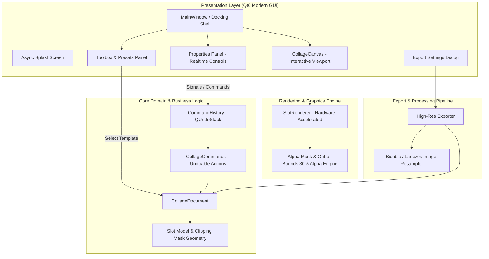

# PhotoColla - Proje Mimari Dokümantasyonu (PROJECT_ARCHITECTURE.md)

## 1. Genel Mimari Bakış (Architecture Overview)

PhotoColla, profesyonel standartlarda (Figma, Photoshop, Lightroom kalitesinde) donanım ivmelendirmeli fotoğraf kolaj masaüstü yazılımıdır. Proje, **Clean Architecture**, **SOLID** prensipleri, **Command Pattern** ve **asenkron iş parçacığı (multithreading)** mimarisine dayanır.



---

## 2. Dizin Yapısı ve Modül Sorumlulukları

```
photo-colla/
├── CMakeLists.txt                  # Kök C++20 / Qt6 derleme yapılandırması
├── cmake/
│   ├── CompilerWarnings.cmake      # Katı derleyici uyarı bayrakları (-Wall, -Wextra, -Wpedantic vb.)
│   └── Sanitizers.cmake            # ASan / UBSan hata ayıklama araçları
├── assets/
│   ├── icons/                      # Vektörel SVG arayüz ikonları
│   ├── styles/
│   │   ├── dark_theme.qss          # Figma / Lightroom tarzı modern profesyonel koyu tema
│   │   └── light_theme.qss         # Açık tema alternatifi
│   └── templates/
│       └── default_templates.json  # Hazır kolaj şablon şemaları
├── resources.qrc                   # Qt Resource XML tanımı
├── src/
│   ├── main.cpp                    # Uygulama başlangıç ve DPI yapılandırması
│   ├── core/                       # Saf iş mantığı (UI'dan bağımsız)
│   │   ├── models/                 # Slot, Doküman, Layout motoru ve Transform veri yapıları
│   │   │   ├── slot.h/.cpp
│   │   │   ├── collage_document.h/.cpp
│   │   │   └── auto_layout_engine.h/.cpp # Dinamik aspect-ratio korumalı otomasyon
│   │   ├── commands/               # QUndoCommand tabanlı geri/ileri alınabilir komutlar
│   │   │   └── collage_commands.h/.cpp
│   │   └── history/                # Undo/Redo yığını yöneticisi
│   │       └── command_history.h/.cpp
│   ├── ui/                         # Qt arayüz katmanı
│   │   ├── main_window.h/.cpp      # Ana pencere ve QDockWidget düzeni
│   │   ├── splash/                 # Asenkron kaynak yükleme ekranı
│   │   │   └── splash_screen.h/.cpp
│   │   ├── canvas/                 # Donanım ivmelendirmeli interaktif çalışma alanı
│   │   │   ├── collage_canvas.h/.cpp
│   │   │   └── slot_renderer.h/.cpp
│   │   ├── toolbox/                # Sol panel: Şablon ve resim kütüphanesi
│   │   │   └── toolbox_panel.h/.cpp
│   │   ├── properties/             # Sağ panel: Border, Margin, Padding, Radius kontrolleri
│   │   │   └── properties_panel.h/.cpp
│   │   └── dialogs/                # Çıktı ve diyalog pencereleri
│   │       ├── export_dialog.h/.cpp
│   │       ├── welcome_dialog.h/.cpp
│   │       └── select_photos_dialog.h/.cpp
│   └── export/                     # Yüksek çözünürlüklü çıktı motoru
│       └── exporter.h/.cpp
└── PROJECT_ARCHITECTURE.md         # Canlı tutulan mimari sözlük ve plan
```

---

## 3. Slot ve Clipping Mask Render Mekaniği (Kritik Gereksinim)

PhotoColla'nın temel yeniliği çift katmanlı clipping mask ve out-of-bounds alpha geri bildirimidir:

1. **Normal Mod:**
   - Fotoğraf, ait olduğu slotun sınırları (margin, padding, border radius) içerisinde `QPainterPath` maskesiyle kırpılır (`setClipPath`).
   - Sınırlar dışındaki pikseller ekranda görünmez.
2. **Edit Modu (Aktif / Seçili Slot):**
   - **İç Alan (%100 Opak):** Slot çerçevesi içinde kalan görsel alan net ve tam opak olarak çizilir.
   - **Taşan Kısım (%30 Alpha):** Slot çerçevesinin dışında kalan (kırpılacak olan) ham fotoğraf alanı %30 yarı-saydamlıkla çizilir.
   - **Etkileşim:** Kullanıcı bu sayede fotoğrafın kadraj dışı kalan kısımlarını doğrudan görerek pan (sürükleme) ve zoom/scale (boyutlandırma) işlemlerini milimetrik olarak yönetebilir.

---

## 4. Undo/Redo Mimarisi (Command Pattern)

Tüm kullanıcı eylemleri (`QUndoStack`):
- `SetImageCommand`: Slota görsel atama veya değiştirme.
- `TransformSlotImageCommand`: Görselin pan konumu veya ölçek değerini değiştirme.
- `UpdateLayoutPropertiesCommand`: Border width, margin, padding, border radius veya renk değişimleri.
- `ApplyTemplateCommand`: Şablon değiştirme.

Her komut atomik, serializable ve tersine çevrilebilir (`undo()` ve `redo()`).

---

## 5. Export Pipeline (High-Res & 300 DPI)

- Ekrandaki viewport ölçeğinden bağımsız olarak, kullanıcı tarafından seçilen hedef çözünürlükte (ör. 4K, 8K veya A4/A3 300 DPI baskı boyutu) off-screen frame buffer / `QImage` üzerine render alınır.
- Bilinear/Bicubic resampling ile keskin ve kayıpsız çıktı üretilir.
- Desteklenen formatlar: PNG (kayıpsız), JPG (ayarlanabilir kalite sıkıştırması), WebP.

---

## 6. Geliştirme Adımları Yol Haritası

- [x] **ADIM 1:** Kurumsal klasör mimarisi, `CMakeLists.txt`, `dark_theme.qss`, `PROJECT_ARCHITECTURE.md`.
- [x] **ADIM 2:** Asenkron Splash Screen ve Ana Docking Window (Sol Toolbox, Orta Canvas, Sağ Properties) Qt iskeleti.
- [x] **ADIM 3:** `CollageCanvas` sınıfı, GPU destekli Slot / Clipping Mask ve Out-of-bounds %30 alpha render motoru.
- [x] **ADIM 4:** Sağ panel kontrollerinin (Margin, Radius, Border, Stroke) dinamik Signal/Slot ve Command entegrasyonu.
- [x] **ADIM 5:** High-res ve 300 DPI Export motoru (PNG, JPG, WebP).
- [x] **ADIM 6:** `AutoLayoutEngine` ile fotoğrafların aspect-ratio (en/boy oranı) değerlerini analiz edip kırpmayı (crop) minimize eden akıllı dinamik bsp/masonry grid algoritması eklendi.

---

## 7. Auto Layout (Smart Collage) Mekaniği

Kullanıcının yüklediği fotoğrafların orijinal oranlarına göre matematiksel hesaplama yapar:
1. Yüklenen fotoğrafların aspect-ratio'ları hesaplanır.
2. Dinamik Programlama (DP) / Heuristic yaklaşımlarla yatay (satır tabanlı) veya dikey (sütun tabanlı) olacak şekilde en az cropping/bozulma yaratacak bölütleme yapılır.
3. Bulunan bu bölütleme, oransal olarak normalleştirilmiş (0.0 - 1.0) koordinatlara dönüştürülür ve hazır şablona gerek kalmadan tamamen dinamik yeni Slot'lar üretilir.

---

## 7. Hızlı Derleme ve Çalıştırma (Build & Run)

### Linux:
```bash
./run.sh          # Release profiliyle hızlıca derler ve başlatır
./run.sh --debug  # Debug profili ve sanitizer'lar ile derler
./run.sh --clean  # Sıfırdan temiz derleme yapar
```

### Windows:
Projeyi Windows ortamında çalıştırmak için `run_windows.bat` dosyasına çift tıklanabilir veya CMD'den çalıştırılabilir:
```cmd
run_windows.bat
```
Bu script şunları otomatik yapar:
1. `CMake`'i arar (yoksa `winget` ile kurar).
2. `Visual Studio 2022 C++ Build Tools` veya `MinGW` derleyicisini hazırlar.
3. `Qt 6` kütüphanesini otomatik tespit eder (yoksa otomatik indirir).
4. `PhotoColla.exe`'yi Release modunda derler.
5. `windeployqt` ile gereken tüm Qt DLL ve platform eklentilerini binary'nin yanına kopyalar.
6. `PhotoColla.exe`'yi başlatır.
