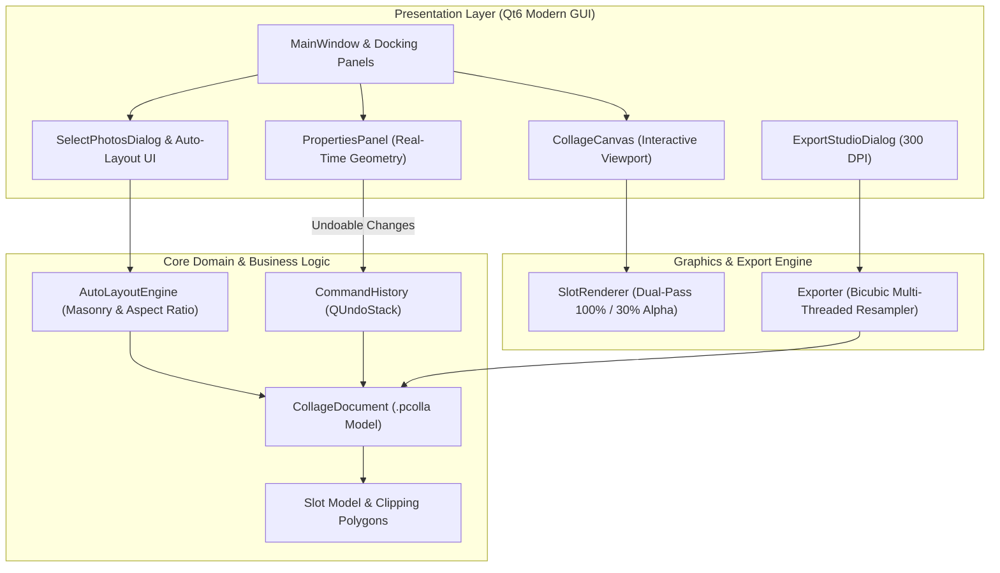

# PhotoColla Studio 🎨🖼️

[](LICENSE)
[](https://en.wikipedia.org/wiki/C%2B%2B20)
[](https://www.qt.io/)
[](#-stand-alone-executables-no-installation-required)

> **Commercial-Grade, Hardware-Accelerated Desktop Photo Collage Studio**  
> Built with modern C++20 and Qt 6. Engineered for professional creators, photographers, and print designers with non-destructive dual-pass clipping masks, intelligent aspect-ratio masonry layout generation, a real-time geometry inspector, and 300 DPI print-ready rendering.

---

## 🌟 Key Features

### 1. 🎨 Dual-Pass Clipping Mask & Alpha Ghost View
- **100% Precision Positioning:** Active photos inside slots render with 100% opaque clipping inside the geometric boundary, while extending outside with an elegant **30% semi-transparent ghost view**.
- **Effortless Transform:** Pan, zoom, and scale oversized images inside arbitrary frames without ever losing context of hidden boundaries.
- **Interactive Multi-Touch & Wheel Zoom:** Smooth canvas navigation with dynamic mouse wheel centering and intuitive drag-and-drop.

### 2. ⚡ Smart Masonry & Aspect-Ratio Auto-Layout
- **Zero-Distortion Layouts:** Calculates optimal collage arrangements matching the natural aspect ratios of selected photos (1:1 square, 4:5 portrait, 16:9 widescreen).
- **Interactive Photo Picker:** Choose photos directly from the built-in library, batch select or deselect, and let the layout engine organize your grid instantly.
- **Instant Template Library:** Comes with ready-to-use professional layout presets (Grids, Diptych, Triptych, Golden Ratio).

### 3. 🛠️ Studio Inspector & Real-Time Sync
- **Live Canvas Geometry:** Adjust canvas margins, slot spacing (padding), border thickness, and corner rounding (**border radius**) with instant 60 FPS viewport feedback.
- **Color Styling:** Fine-tune canvas background colors and slot border strokes with interactive native color pickers.
- **Aspect Ratio Presets:** Switch between Instagram Post (1:1), Story/Reels (9:16), Print A4, and Landscape (16:9) with a single click.

### 4. 🖨️ 300 DPI Print Pipeline & Multi-Format Exporter
- **Ultra High-Resolution Engine:** Renders collages up to 8K Ultra-HD with full anti-aliasing and sub-pixel bicubic resampling.
- **Print-Ready Standards:** Embeds physical 300 DPI resolution tags for direct commercial photo lab printing.
- **Versatile Presets:** Export to lossless **PNG**, optimized **JPG** (custom quality 50–100%), or modern **WebP**.

### 5. 🔄 Non-Destructive Workflow & Project Persistence
- **Full Undo/Redo (Command Pattern):** Every transformation, slot swap, color tweak, and margin change is tracked on an undo stack (`Ctrl+Z` / `Ctrl+Y`).
- **Native `.pcolla` Format:** Save your active projects and reopen them anytime with all photo links, slot dimensions, and styling properties intact.

---

## 📦 Stand-Alone Executables (No Installation Required)

You do **not** need to install Qt, C++ compilers, or runtime dependencies. Grab the pre-built portable binary for your operating system directly from [Releases](https://github.com/hakankayaci-smilegames/photo-colla/releases):

| Operating System | Package | Instructions |
|---|---|---|
| **Windows (x64)** | `PhotoColla-Windows-x64.zip` | Extract and double-click `PhotoColla.exe` *(All MSYS2 UCRT64, GCC, & Qt6 DLLs bundled)* |
| **Linux (x64)** | `PhotoColla-Portable-Linux.zip` | Extract and execute `./PhotoColla` |

---

## ⌨️ Studio Keyboard Shortcuts

| Shortcut | Action | Description |
|---|---|---|
| <kbd>Ctrl</kbd> + <kbd>N</kbd> | **New Project** | Start a fresh collage canvas |
| <kbd>Ctrl</kbd> + <kbd>O</kbd> | **Open Project** | Load a saved `.pcolla` studio project |
| <kbd>Ctrl</kbd> + <kbd>S</kbd> | **Save Project** | Save changes to the active `.pcolla` file |
| <kbd>Ctrl</kbd> + <kbd>Shift</kbd> + <kbd>S</kbd> | **Save As** | Save current state as a new project |
| <kbd>Ctrl</kbd> + <kbd>E</kbd> | **Export** | Open the 300 DPI Multi-Format Export Studio |
| <kbd>Ctrl</kbd> + <kbd>Z</kbd> | **Undo** | Revert the last canvas or property action |
| <kbd>Ctrl</kbd> + <kbd>Y</kbd> / <kbd>Shift</kbd>+<kbd>Ctrl</kbd>+<kbd>Z</kbd> | **Redo** | Reapply the undone change |
| <kbd>Ctrl</kbd> + <kbd>+</kbd> / <kbd>-</kbd> | **Zoom In / Out** | Zoom the collage viewport |
| <kbd>Ctrl</kbd> + <kbd>0</kbd> | **Reset Zoom** | Fit canvas to current viewport window |
| <kbd>Delete</kbd> | **Remove Photo** | Remove photo from the currently selected slot |

---

## 🛠️ Build from Source

### Prerequisites
- **C++20 Compliant Compiler:** GCC 11+, Clang 13+, or MSVC 2022
- **CMake:** Version 3.20 or newer
- **Qt 6:** Core, Gui, Widgets, Svg, OpenGL

---

### 🐧 Linux (Arch / CachyOS / Fedora / Ubuntu)

#### 1. Install Dependencies
```bash
# Arch Linux / CachyOS / Manjaro:
sudo pacman -S base-devel cmake qt6-base qt6-svg

# Ubuntu / Debian (22.04+):
sudo apt install build-essential cmake qt6-base-dev qt6-svg-dev libgl1-mesa-dev

# Fedora:
sudo dnf install gcc-c++ cmake qt6-qtbase-devel qt6-qtsvg-devel
```

#### 2. Clone & Build
```bash
git clone https://github.com/hakankayaci-smilegames/photo-colla.git
cd photo-colla

cmake -B build -DCMAKE_BUILD_TYPE=Release
cmake --build build -j$(nproc)
```

#### 3. Run
```bash
./build/PhotoColla
```

---

### 🪟 Windows (MSYS2 UCRT64)

#### 1. Open MSYS2 UCRT64 Terminal & Install Dependencies
```bash
pacman -S --needed \
    mingw-w64-ucrt-x86_64-gcc \
    mingw-w64-ucrt-x86_64-cmake \
    mingw-w64-ucrt-x86_64-ninja \
    mingw-w64-ucrt-x86_64-qt6-base \
    mingw-w64-ucrt-x86_64-qt6-svg
```

#### 2. Clone & Build
```bash
git clone https://github.com/hakankayaci-smilegames/photo-colla.git
cd photo-colla

cmake -B build -G "Ninja" -DCMAKE_BUILD_TYPE=Release
cmake --build build
```

#### 3. Run
```bash
./build/PhotoColla.exe
```

---

## 🏗️ Architecture & Clean Design

PhotoColla adheres strictly to **Clean Architecture** and **Qt Model/View** paradigms:



---

## 🤝 Contributing

Contributions, issues, and feature suggestions are always welcome!  
Feel free to open an issue or submit a pull request on the [GitHub Issues](https://github.com/hakankayaci-smilegames/photo-colla/issues) page.

---

## 📄 License

This project is open-source and licensed under the [MIT License](LICENSE).
